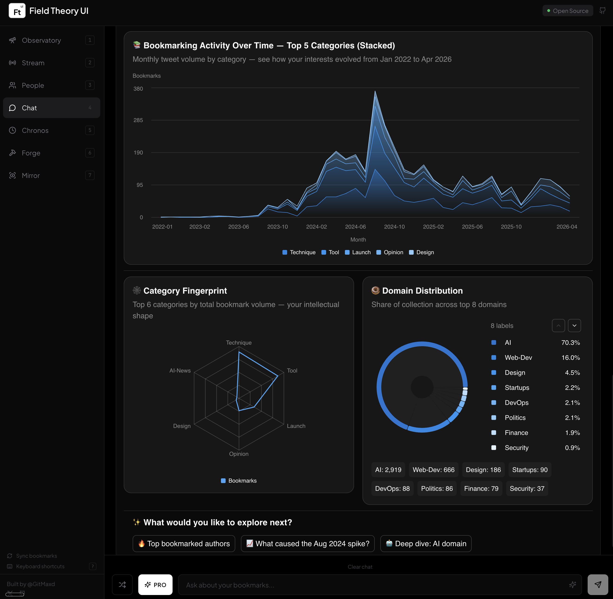

# Field Theory UI

Local-first web interface for exploring your X/Twitter bookmarks. Built on the [fieldtheory CLI](https://github.com/afar1/fieldtheory-cli).

**Read-only** · **Zero cloud** · **Dark mode**

<p align="center">
  
</p>

- Search, filter, and explore thousands of bookmarks with full-text search
- Ask natural language questions and get interactive dashboards back
- See how your interests evolve over time, who you bookmark, and what repos you're collecting

## Quick Start

**Requires:** [Node.js](https://nodejs.org/) v20+ and [fieldtheory CLI](https://github.com/afar1/fieldtheory-cli) v1.2.0+ with synced bookmarks.

```sh
git clone https://github.com/Gitmaxd/field-theory-ui.git
cd field-theory-ui
npm install
./start.sh
```

Open [http://localhost:3939](http://localhost:3939). The start script builds, launches, and prints a QR code for mobile access on your local network.

## Views


| View            | What it does                                                             |
| --------------- | ------------------------------------------------------------------------ |
| **Observatory** | Dashboard with KPIs, activity sparkline, category/domain charts          |
| **Stream**      | Full-text search with filters by category, domain, author, date range    |
| **People**      | Author grid with per-person activity, topic breakdown, connected authors |
| **Chat**        | Natural language Q&A with Pro mode interactive dashboards, token streaming, and copy/download actions |
| **Chronos**     | Time-series charts showing how your interests shift month over month     |
| **Forge**       | GitHub repos extracted from your bookmarks, ranked and trackable         |
| **Mirror**      | Self-analysis of your own bookmarked posts vs. what you consume          |


## Chat

Chat is an AI-powered interface for querying your bookmarks. It operates in two modes with increasing capability, backed by a [LangChain](https://langchain.com) ReAct agent that autonomously selects tools to answer your questions.

### Standard Mode

Works out of the box with no API keys. Uses [Claude Code CLI](https://docs.anthropic.com/en/docs/claude-code), [Codex CLI](https://github.com/openai/codex), or built-in pattern matching (first available) to translate natural language into API calls against your bookmark collection.

### Pro Mode

Adds a LangChain ReAct agent with tool calling and interactive dashboards -- charts, tables, KPI cards, and follow-up buttons rendered as live React components via [OpenUI](https://github.com/nicholasgasior/openui). Enable it by adding an API key:

```sh
cp .env.example .env
# Set ANTHROPIC_API_KEY or OPENAI_API_KEY in .env
```

A PRO toggle appears in the Chat input bar when a key is detected. The agent auto-detects your provider and selects the appropriate model (`anthropic:claude-sonnet-4-6` or `openai:gpt-5.4-mini`, overridable via `CHAT_MODEL`). When using Anthropic, the system prompt is cached across agent invocations to reduce latency and token cost on multi-step queries. Pro mode markdown responses include Copy and Download actions for extracting LLM-generated analysis.

### Agent Tools

The Pro mode agent has access to the following tools and autonomously decides which to call, in what order, chaining up to 8 tool invocations per query:

| Tool | Source | Description |
|------|--------|-------------|
| `execute_sql` | Local database | Sandboxed read-only SQL against your bookmarks database. Features FTS5 full-text search, custom date parsing functions (`parse_twitter_date_ymd`), live schema introspection, automatic retry on query failure (up to 5 attempts), and automatic LIMIT injection. All queries are validated: SELECT-only, no DML/DDL, single-statement. |
| `TavilySearch` | Live web | Real-time internet search via [Tavily](https://tavily.com). Returns up to 5 results per query. The agent uses this to research topics beyond your bookmarks, verify trends with current data, or supplement local results with external sources. Activated when `TAVILY_API_KEY` is set. |

When both tools are available, the agent queries your bookmarks first for local context, then searches the web for current information, then synthesizes both sources in its response.

**Example prompts showing tool usage:**

> **Database only:** "Build a dashboard comparing my top 5 categories by volume over the last 6 months" -- the agent writes aggregation queries via `execute_sql` and renders an interactive OpenUI dashboard with charts and KPI cards.
>
> **Web search only:** "What are the latest developments in AI agent frameworks?" -- the agent calls `TavilySearch` for current web results and responds with a markdown summary of its findings.
>
> **Combined (local + web):** "Research the topics I've been bookmarking about AI agents and tell me what I'm missing" -- the agent queries your bookmarks via `execute_sql` to map your AI agent content, then uses `TavilySearch` for current developments, then synthesizes the gaps between what you've saved and what's happening now.
>
> **Combined (verification):** "I bookmarked several posts about Rust -- is it still gaining traction?" -- the agent pulls your Rust bookmark data for context, searches the web for current adoption metrics, and compares the two.

### Streaming

Pro mode streams responses in real time with step-level progress indicators ("Thinking...", "Querying database...", "Generating response..."). Text responses stream with progressive markdown rendering and a blinking cursor. Dashboard responses render progressively during streaming as the OpenUI Renderer assembles interactive components in real time. Both Anthropic and OpenAI token formats are handled natively.

### UX Details

The input auto-expands up to 7 lines (Shift+Enter inserts a newline). The **Surprise Me** button fetches a random bookmark from your collection.

## Development

```sh
npm run dev              # Vite dev server with HMR
npm run server           # API server only (port 3939)
npm run mcp              # MCP stdio server (for Claude Desktop, Claude Code, etc.)
npm run build            # Production build
npm run typecheck        # tsc --noEmit
npm run lint             # ESLint
npm test                 # Vitest
npm run generate:prompt  # Regenerate OpenUI component reference for Chat Pro
```

## MCP Server

Field Theory exposes your local bookmarks as an MCP server so external agents (Claude Desktop, Claude Code, Cursor, …) can search, read, and organise them into Collections. The server runs over stdio and reads/writes the same `~/.ft-bookmarks/bookmarks.db` that the UI uses.

**Tools:**

| Tool | Purpose |
| ---- | ------- |
| `search_bookmarks` | Full-text search, filter by author/category/domain/collection/date |
| `get_bookmark` | Fetch one bookmark (with current collection memberships) |
| `get_conversation` | All bookmarks in a reply thread |
| `stats`, `list_categories`, `list_domains` | Overview + facet discovery |
| `list_collections`, `create_collection`, `delete_collection` | Collection CRUD |
| `add_to_collection`, `remove_from_collection` | Bulk membership edits (tagged `added_by="mcp"`) |
| `get_bookmarks_by_collection` | Paginated list for one collection |

**Claude Desktop config** (`~/Library/Application Support/Claude/claude_desktop_config.json`):

```json
{
  "mcpServers": {
    "field-theory": {
      "command": "npx",
      "args": ["tsx", "/ABSOLUTE/PATH/TO/field-theory-ui/server/mcp/index.ts"]
    }
  }
}
```

**Claude Code config** (`~/.claude/config.json` or `.mcp.json` in the project):

```json
{
  "mcpServers": {
    "field-theory": {
      "command": "npm",
      "args": ["--prefix", "/ABSOLUTE/PATH/TO/field-theory-ui", "run", "mcp"]
    }
  }
}
```

After configuring, ask your agent things like *"search my bookmarks for LangChain + web search tools"* or *"add the last 10 AI-news bookmarks to a collection called Weekly Digest"* and it'll call these tools directly.

## Environment Variables


| Variable            | Default           | Description                                         |
| ------------------- | ----------------- | --------------------------------------------------- |
| `PORT`              | `3939`            | Server port                                         |
| `FT_DATA_DIR`       | `~/.ft-bookmarks` | Directory containing `bookmarks.db`                 |
| `ANTHROPIC_API_KEY` | --                | Enables Chat Pro with Claude                        |
| `OPENAI_API_KEY`    | --                | Enables Chat Pro with GPT                           |
| `TAVILY_API_KEY`    | --                | Enables web search in Chat Pro ([Tavily](https://tavily.com)) |
| `CHAT_MODEL`        | auto              | Override model (default: `anthropic:claude-sonnet-4-6` or `openai:gpt-5.4-mini` based on detected key) |
| `LANGSMITH_TRACING` | --                | Set to `true` to enable [LangSmith](https://smith.langchain.com) tracing |
| `LANGSMITH_API_KEY`  | --                | LangSmith API key for trace collection        |
| `LANGSMITH_PROJECT`  | --                | LangSmith project name for trace organization  |
| `LANGSMITH_ENDPOINT` | `https://api.smith.langchain.com` | LangSmith API endpoint           |


<details>
<summary><strong>CLI Compatibility</strong></summary>

| CLI Version | Released        | Status                                                   |
| ----------- | --------------- | -------------------------------------------------------- |
| ~~1.0.x~~   | Apr 3, 2026     | Unsupported -- missing required columns                  |
| ~~1.1.0~~   | Apr 4, 2026     | Unsupported -- missing engagement columns                |
| 1.2.x       | Apr 4-5, 2026   | Compatible (schema v3)                                   |
| **1.3.x**   | **Apr 8, 2026** | **Recommended** -- quoted tweets, conversation threading |

The UI validates the schema on startup. Optional columns from newer CLI versions degrade gracefully. Date parsing handles both Twitter-style and ISO 8601 formats.

For full feature coverage, upgrade to v1.3.x:

```sh
npm update -g fieldtheory
ft sync --gaps
```

</details>


<details>
<summary><strong>API Endpoints</strong></summary>

All endpoints return JSON and include CORS headers. Each request opens a fresh database connection so data is always current after syncing.

| Endpoint                                                                 | Description                                   |
| ------------------------------------------------------------------------ | --------------------------------------------- |
| `GET /api/stats`                                                         | Aggregate counts, date range, this-week total |
| `GET /api/recent?limit=N`                                                | Most recent bookmarks                         |
| `GET /api/search?q=&author=&category=&domain=&after=&before=&limit=&offset=` | Full-text search with filters            |
| `GET /api/categories`                                                    | Category distribution                         |
| `GET /api/domains`                                                       | Domain distribution                           |
| `GET /api/timeline?days=N`                                               | Daily bookmark counts                         |
| `GET /api/top-authors?limit=N`                                           | Authors ranked by bookmark count              |
| `GET /api/author/:handle`                                                | Author profile with breakdowns                |
| `GET /api/bookmark/:id`                                                  | Single bookmark detail                        |
| `GET /api/conversations?limit=N`                                         | Conversation threads ranked by count          |
| `GET /api/conversations/:id`                                             | All bookmarks in a conversation thread        |
| `GET /api/github-repos`                                                  | GitHub repos extracted from bookmarks         |
| `GET /api/github-metadata`                                               | GitHub API metadata (cached)                  |
| `GET /api/self-bookmarks?handle=X`                                       | Your own bookmarked posts                     |
| `GET /api/monthly-breakdown`                                             | Per-month category, domain, author data       |
| `GET /api/technique-backlog`                                             | Technique bookmarks grouped by domain         |
| `GET /api/random-bookmark`                                               | Random bookmark                               |
| `GET /api/oracle?q=&context=`                                            | Chat query (standard mode)                    |
| `POST /api/oracle/stream`                                                | Chat Pro streaming (SSE with step-level progress) |
| `GET /api/oracle/status`                                                 | Chat Pro and web search availability          |
| `POST /api/sync`                                                         | Trigger bookmark sync & classify              |
| `GET /api/sync/stream`                                                   | SSE stream of sync progress                   |
| `GET /api/sync/status`                                                   | Current sync process status                   |

</details>


<details>
<summary><strong>Keyboard Shortcuts</strong></summary>

| Key        | Action                      |
| ---------- | --------------------------- |
| `1` -- `7` | Switch views                |
| `/`        | Focus search                |
| `j` / `k`  | Move down / up in lists     |
| `o`        | Open selected bookmark on X |
| `Esc`      | Close overlay or blur input |
| `?`        | Toggle shortcuts help       |

Shortcuts are suppressed when an input field is focused.

</details>


<details>
<summary><strong>Tech Stack</strong></summary>

| Layer         | Technology                                                    |
| ------------- | ------------------------------------------------------------- |
| Frontend      | React 19, TypeScript, Vite, Tailwind CSS, shadcn/ui, Recharts |
| AI Agent      | LangChain (ReAct agent, tool calling, Tavily web search, model auto-detection) |
| Generative UI | OpenUI (parser, Renderer, component library)                  |
| Backend       | Node.js HTTP server, better-sqlite3 (read-only)               |
| Routing       | react-router-dom v7                                           |
| Font          | Plus Jakarta Sans, JetBrains Mono                             |

</details>


## Author

Built by [@GitMaxd](https://x.com/GitMaxd) -- [github.com/GitMaxd](https://github.com/GitMaxd)

## License

[MIT](LICENSE)